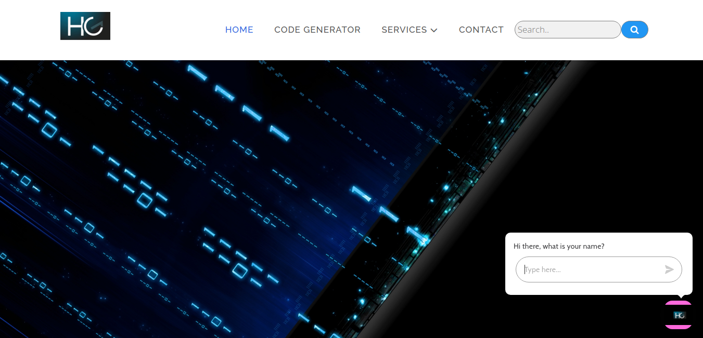
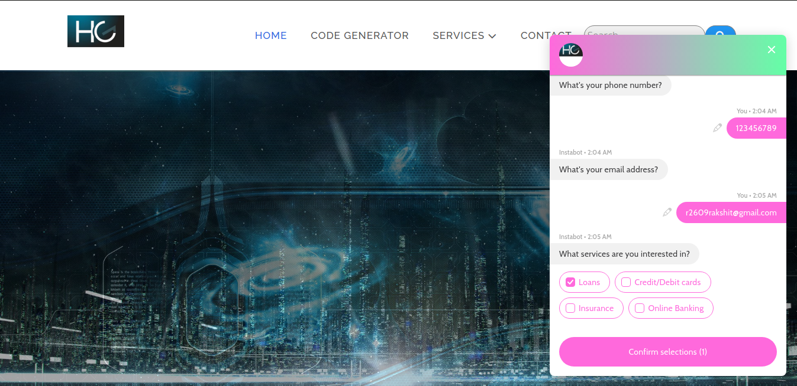
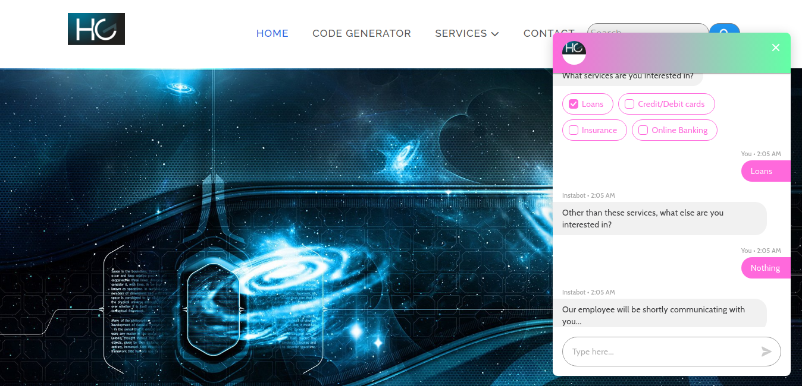
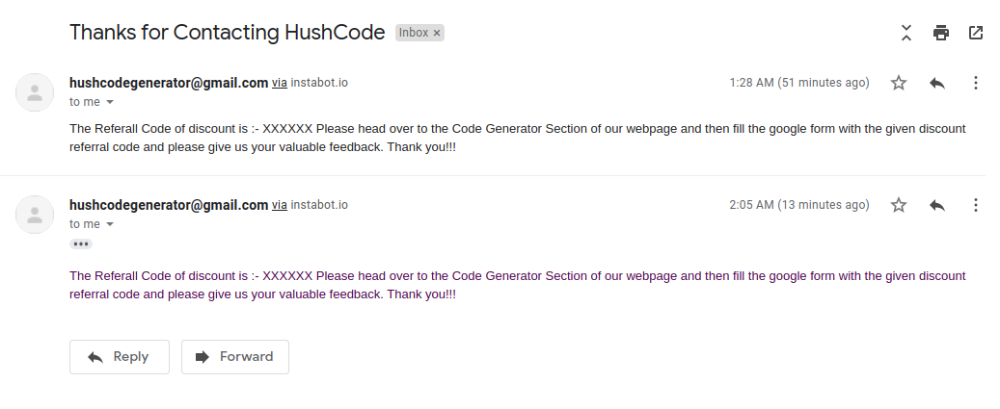
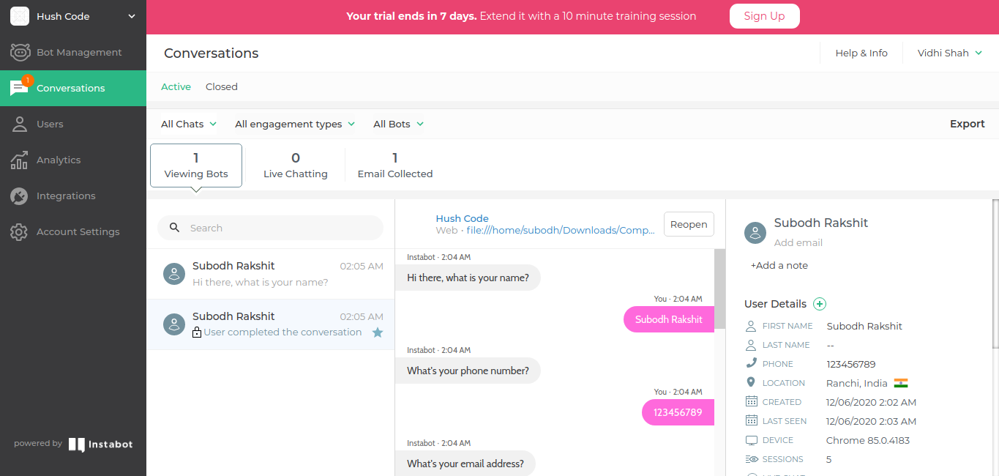
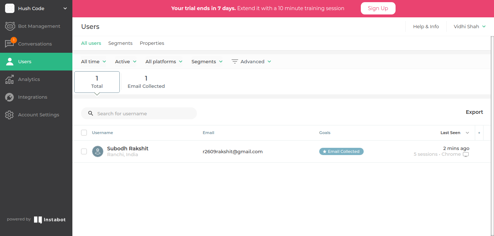

# Hush-Code-Generator

Click on the index.html to get started with the homepage

In the right end of the webpage you will get a Automated Bot which will take the valuable information from the user as shown below
 

 
We need to provide all the information for the referral code to be generated for the particular service as shown below
 
 
NOTE: PLEASE TRY IT ONCE TO GET THE GLIMPSE OF THE WORKING WEBSITE AND THE BOT FOR THE GENERATION OF REFERRAL CODE.
MAKE SURE YOU GIVE YOUR VALID EMAIL ID SUCH THAT YOU WILL GET THE REFERRAL CODE AS A SAMPLE TO THE EMAIL PROVIDED IN THE AUTOMATED BOT QUESTION SECTION
 

 
After the whole thing is done it will tell you that "our employee will be shortly communicating with you" as shown below
 

 
After the whole thing is done we will get an automated mail in our given mail id in automated bot for contacing HushCode and for Referral link also
 
 

 
In the backend we can get every response by the user interaction with the bot which will help us what type of things that most of the user wants
 
 

 

  
Finally under the Code Generator section there will be a Google form in which they need to type the referral code. 
If the Referral code matches with the given referral code sent to the user, then the user will get a valid discount
 
Finally we have a feedback section for generating the feedback of the users and hence valuable for any of the companies. 
